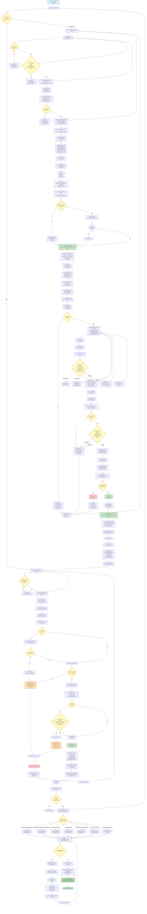

```mermaid
graph TD
    Start(["Start: User Opens Application"]) --> LoginPage["Display Login Page"]
    
    LoginPage --> Decision1{"User Selects<br/>Login or<br/>Forgot Password?"}
    
    %% NORMAL LOGIN PATH
    Decision1 -->|Login| EnterCreds["Enter Email/Username<br/>and Password"]
    EnterCreds --> ClientValidate{"Email/Username<br/>and Password<br/>Filled?"}
    
    ClientValidate -->|No| ClientError["Display Error:<br/>Please fill in all fields"]
    ClientError --> EnterCreds
    
    ClientValidate -->|Yes| SubmitLogin["Submit Login Credentials<br/>via loginAction"]
    SubmitLogin --> ServerValidate["Server Action:<br/>Extract and Validate<br/>Form Data"]
    
    ServerValidate --> CallNextAuth["Call NextAuth signIn<br/>with Credentials Provider"]
    CallNextAuth --> AuthorizeFunc["Credentials Provider<br/>authorize Function"]
    
    AuthorizeFunc --> DBLookup1["Lookup User by Email<br/>case-insensitive"]
    DBLookup1 --> EmailFound{"User Found<br/>by Email?"}
    
    EmailFound -->|No| DBLookup2["Lookup User by Username<br/>case-insensitive"]
    EmailFound -->|Yes| GetUser["Retrieved User Object"]
    
    DBLookup2 --> UsernameFound{"User Found<br/>by Username?"}
    UsernameFound -->|No| UserNotFound["User or Role<br/>Not Found in Database"]
    UsernameFound -->|Yes| GetUser
    
    UserNotFound --> AuditFail1["Create Audit Log:<br/>LOGIN_FAILED<br/>Reason: User or role<br/>not found"]
    AuditFail1 --> ReturnNull1["Return null to NextAuth"]
    ReturnNull1 --> AuthFailed["Authentication Failed"]
    
    GetUser --> CheckRole{"User has Valid<br/>Role Assigned?"}
    CheckRole -->|No| AuditFail1
    CheckRole -->|Yes| ValidatePass["Extract Password Hash<br/>from User Record"]
    
    ValidatePass --> ComparePass["Compare Provided Password<br/>with Hash using<br/>bcryptjs.compare"]
    ComparePass --> PassMatch{"Password<br/>Match?"}
    
    PassMatch -->|No| CheckFallback{"Is Fallback Auth<br/>Enabled?<br/>Password = 'Password123'<br/>& Email ends with<br/>'@dbu.edu.et'?"}
    CheckFallback -->|No| PasswordFail["Password Mismatch"]
    CheckFallback -->|Yes| PasswordValid["Password Valid<br/>via Fallback"]
    
    PassMatch -->|Yes| PasswordValid
    
    PasswordFail --> AuditFail2["Create Audit Log:<br/>LOGIN_FAILED<br/>Reason: Incorrect<br/>password"]
    AuditFail2 --> ReturnNull1
    
    PasswordValid --> AuditSuccess["Create Audit Log:<br/>LOGIN action"]
    AuditSuccess --> ReturnUser["Return User Object<br/>to NextAuth:<br/>id, name, email,<br/>role, departmentId,<br/>departmentName,<br/>mustChangePassword"]
    
    ReturnUser --> JWTCallback["NextAuth JWT Callback:<br/>Store User Data in<br/>JWT Token"]
    JWTCallback --> SessionCallback["NextAuth Session Callback:<br/>Populate Session Object<br/>with User Data"]
    SessionCallback --> Redirect1["Redirect to<br/>root path: /"]
    
    Redirect1 --> MiddlewareCheck["Middleware Intercepts<br/>Request to /"]
    MiddlewareCheck --> CheckLogin{"Is User<br/>Logged In<br/>& Valid Role?"}
    
    CheckLogin -->|No| RedirectLogin["Redirect to /login"]
    RedirectLogin --> LoginPage
    
    CheckLogin -->|Yes| GetDashboard["Call getRoleDashboard<br/>function with user.role"]
    GetDashboard --> DetermineDash{"Determine Role<br/>and Dashboard"}
    
    DetermineDash -->|SYSTEM_ADMINISTRATOR| AdminDash["Target Dashboard:<br/>/admin/dashboard"]
    DetermineDash -->|PROPERTY_ADMINISTRATION_OFFICER| PaoDash["Target Dashboard:<br/>/pao/dashboard"]
    DetermineDash -->|DEPARTMENT_HEAD| HeadDash["Target Dashboard:<br/>/head/dashboard"]
    DetermineDash -->|STAFF_MEMBER| StaffDash["Target Dashboard:<br/>/staff/dashboard"]
    DetermineDash -->|MAINTENANCE_TECHNICIAN| TechDash["Target Dashboard:<br/>/tech/dashboard"]
    DetermineDash -->|INTERNAL_AUDITOR| AuditorDash["Target Dashboard:<br/>/auditor/dashboard"]
    DetermineDash -->|INVENTORY_PERSON| InventoryDash["Target Dashboard:<br/>/inventory"]
    
    AdminDash --> CheckMustChange["Check mustChangePassword<br/>flag in JWT token"]
    PaoDash --> CheckMustChange
    HeadDash --> CheckMustChange
    StaffDash --> CheckMustChange
    TechDash --> CheckMustChange
    AuditorDash --> CheckMustChange
    InventoryDash --> CheckMustChange
    
    CheckMustChange --> MustChangeDecision{"mustChangePassword<br/>= true?"}
    
    MustChangeDecision -->|Yes| ForceSecurityPage["Middleware Redirects<br/>to /profile/security"]
    ForceSecurityPage --> SecurityPage["Display Security Page:<br/>Force Password Change"]
    SecurityPage --> ChangePass["User Changes<br/>Password"]
    ChangePass --> UpdateDB["Update User passwordHash<br/>in Database with<br/>bcryptjs hash"]
    UpdateDB --> UpdateFlag["Set mustChangePassword<br/>= false"]
    UpdateFlag --> SessionUpdate["Update JWT Session"]
    SessionUpdate --> CheckMustChange
    
    MustChangeDecision -->|No| LoadDashboard["Load Role-Specific<br/>Dashboard"]
    LoadDashboard --> DisplayDash["Display Authenticated User<br/>Dashboard with<br/>Role-Based Menu & Content"]
    DisplayDash --> AuthSuccess["✓ User Successfully<br/>Authenticated & Logged In"]
    AuthSuccess --> End(["End: User Authenticated"])
    
    AuthFailed --> DisplayErrorMsg["Display Error Message:<br/>'Invalid email or<br/>password.'"]
    DisplayErrorMsg --> ClearForm["Clear Password Field"]
    ClearForm --> EnterCreds
    
    %% FORGOT PASSWORD PATH
    Decision1 -->|Forgot Password| ForgotPage["Display Forgot Password<br/>Page"]
    ForgotPage --> EnterEmail["Enter Registered<br/>Email Address"]
    EnterEmail --> ClientValidateEmail{"Email Address<br/>Provided?"}
    
    ClientValidateEmail -->|No| EmailError["Display Error:<br/>Please enter your<br/>email address"]
    EmailError --> EnterEmail
    
    ClientValidateEmail -->|Yes| ValidateFormat{"Email Format<br/>Valid?<br/>Regex: /^[^\\s@]+@[^\\s@]+\\.[^\\s@]+$/"}
    ValidateFormat -->|No| FormatError["Display Error:<br/>Please enter a<br/>valid email address"]
    FormatError --> EnterEmail
    
    ValidateFormat -->|Yes| SubmitReset["Submit Password Reset<br/>Request via<br/>requestPasswordResetAction"]
    SubmitReset --> NormalizeEmail["Normalize Email:<br/>Trim & Convert<br/>to Lowercase"]
    
    NormalizeEmail --> LookupUser["Query Database for User<br/>WHERE email = normalized_email<br/>AND deletedAt = null"]
    LookupUser --> UserExists{"User Account<br/>Found?"}
    
    UserExists -->|No| UserNotReg["Display Error:<br/>This email address<br/>is not registered<br/>in the system"]
    UserNotReg --> ForgotPage
    
    UserExists -->|Yes| GenToken["Generate Cryptographically<br/>Secure Random Token:<br/>crypto.randomBytes32<br/>64 hex characters"]
    GenToken --> HashToken["Hash Token using SHA-256:<br/>crypto.createHash('sha256')"]
    HashToken --> SetExpiry["Set Token Expiration:<br/>Current Time +<br/>1 Hour"]
    
    SetExpiry --> InvalidateOld["Invalidate Old Tokens:<br/>Update all existing<br/>PasswordResetToken<br/>records for this user<br/>WHERE usedAt = null<br/>AND expiresAt > now"]
    InvalidateOld --> SetUsedAt["Set usedAt = now<br/>for old tokens"]
    SetUsedAt --> CreateRecord["Create New<br/>PasswordResetToken<br/>in Database"]
    CreateRecord --> StoreRecord["Store:<br/>tokenHash,<br/>userId,<br/>expiresAt"]
    
    StoreRecord --> BuildURL["Build Reset URL:<br/>${NEXTAUTH_URL}/reset-password?<br/>token=${rawToken}"]
    BuildURL --> SendEmail["Send Password Reset Email<br/>via sendPasswordResetEmail"]
    SendEmail --> CheckBrevo{"BREVO_API_KEY<br/>Configured?"}
    
    CheckBrevo -->|No| LogConsole["Development Mode:<br/>Log Reset Link<br/>to Console"]
    LogConsole --> AuditResetReq["Create Audit Log:<br/>PASSWORD_RESET_REQUESTED<br/>action"]
    
    CheckBrevo -->|Yes| BrevoSend["Send via Brevo<br/>SMTP API v3/smtp/email"]
    BrevoSend --> BrevoCheck{"Email Send<br/>Success?"}
    BrevoCheck -->|No| EmailFailed["Log Brevo Error"]
    EmailFailed --> AuditResetReq
    BrevoCheck -->|Yes| AuditResetReq
    
    AuditResetReq --> DisplaySuccess["Display Success Message:<br/>'Check Your Email'<br/>'We have sent a password<br/>reset link to your<br/>email address'"]
    DisplaySuccess --> ShowEmailPrompt["Display:<br/>Check Your Email<br/>for Reset Link"]
    ShowEmailPrompt --> UserReceivesEmail["User Receives Email<br/>with Reset Button<br/>and Fallback Link<br/>containing raw token"]
    
    UserReceivesEmail --> UserClicksLink["User Clicks Reset Link<br/>in Email or<br/>Copies/Pastes URL"]
    UserClicksLink --> ResetPageNav["Browser Navigates to:<br/>/reset-password?<br/>token=abc123..."]
    
    ResetPageNav --> ResetPageLoad["Reset Password Page<br/>Loads"]
    ResetPageLoad --> ExtractToken["Extract token<br/>from URL Query<br/>Parameter"]
    ExtractToken --> TokenPresent{"Token Present<br/>in URL?"}
    
    TokenPresent -->|No| NoTokenError["Display Error:<br/>'Missing or invalid<br/>reset token.<br/>Please request a<br/>new reset link'"]
    NoTokenError --> ShowReqNewLink["Display Button:<br/>Request New<br/>Reset Link"]
    ShowReqNewLink --> ForgotPage
    
    TokenPresent -->|Yes| DisplayResetForm["Display Reset Password<br/>Form with:<br/>- New Password field<br/>- Confirm Password field<br/>- Show/Hide toggles<br/>- Reset Password button"]
    
    DisplayResetForm --> EnterNewPass["User Enters<br/>New Password"]
    EnterNewPass --> EnterConfirmPass["User Enters<br/>Confirm Password"]
    EnterConfirmPass --> ClickReset["Click Reset Password<br/>Button"]
    
    ClickReset --> ClientValidateReset{"Client-Side<br/>Validation:<br/>1. Token present?<br/>2. Fields filled?<br/>3. Length >= 6?<br/>4. Passwords match?"}
    
    ClientValidateReset -->|Token Missing| MissingTokenErr["Display Error:<br/>Missing token"]
    MissingTokenErr --> DisplayResetForm
    
    ClientValidateReset -->|Fields Empty| EmptyFieldsErr["Display Error:<br/>Please fill in all<br/>password fields"]
    EmptyFieldsErr --> DisplayResetForm
    
    ClientValidateReset -->|Length < 6| LengthErr["Display Error:<br/>Password must be<br/>at least 6 characters<br/>long"]
    LengthErr --> DisplayResetForm
    
    ClientValidateReset -->|No Match| MismatchErr["Display Error:<br/>Passwords do not<br/>match"]
    MismatchErr --> DisplayResetForm
    
    ClientValidateReset -->|All Valid| CallResetAction["Call resetPasswordAction<br/>Server Action with:<br/>token, password,<br/>confirmPassword"]
    
    CallResetAction --> ServerResetValidate["Server: Validate<br/>All Parameters"]
    ServerResetValidate --> HashInputToken["Hash Input Token<br/>using SHA-256"]
    HashInputToken --> QueryToken["Query PasswordResetToken<br/>table by tokenHash"]
    QueryToken --> TokenFound{"Token Record<br/>Found?"}
    
    TokenFound -->|No| TokenInvalidErr["Display Error:<br/>'Invalid or expired<br/>password reset link.<br/>Please request<br/>a new link'"]
    TokenInvalidErr --> ShowReqNewLink
    
    TokenFound -->|Yes| ValidateRecord{"Validate Token<br/>Record:<br/>1. usedAt = null?<br/>2. expiresAt >= now?<br/>3. user.deletedAt =<br/>null?"}
    
    ValidateRecord -->|Used| TokenInvalidErr
    ValidateRecord -->|Expired| TokenInvalidErr
    ValidateRecord -->|User Deleted| TokenInvalidErr
    
    ValidateRecord -->|All Valid| HashNewPass["Hash New Password<br/>using bcryptjs.hash<br/>with 10 salt rounds"]
    HashNewPass --> StartTransaction["START DATABASE<br/>TRANSACTION"]
    StartTransaction --> UpdateUserPass["Update User Record:<br/>SET passwordHash =<br/>bcryptjs_hash"]
    UpdateUserPass --> UpdateTokenUsed["Update PasswordResetToken:<br/>SET usedAt = now"]
    UpdateTokenUsed --> CheckTransaction{"Both Updates<br/>Succeeded?"}
    
    CheckTransaction -->|No| Rollback["ROLLBACK<br/>Transaction"]
    Rollback --> TransactionErr["Display Error:<br/>Failed to reset<br/>password.<br/>Please try again"]
    TransactionErr --> ShowReqNewLink
    
    CheckTransaction -->|Yes| Commit["COMMIT<br/>Transaction"]
    Commit --> BothUpdated["Both Database<br/>Records Updated<br/>Atomically"]
    BothUpdated --> AuditResetComp["Create Audit Log:<br/>PASSWORD_RESET_COMPLETED<br/>action"]
    
    AuditResetComp --> DisplayResetSuccess["Display Success Message:<br/>'Your password has been<br/>successfully reset!<br/>Redirecting to login...'"]
    DisplayResetSuccess --> ShowSuccessBanner["Display Success Banner<br/>with Checkmark Icon"]
    ShowSuccessBanner --> Delay["Wait 3 Seconds"]
    Delay --> RedirectLogin2["Redirect to<br/>/login?reset=success"]
    
    RedirectLogin2 --> LoginPageSuccess["Login Page Loads<br/>with Success Message:<br/>'Password reset<br/>successfully!<br/>Please sign in with<br/>your new password'"]
    LoginPageSuccess --> UserCanLogin["User Can Now Log In<br/>with New Password"]
    UserCanLogin --> EnterCreds
    
    style Start fill:#e1f5ff,stroke:#0277bd,stroke-width:2px
    style End fill:#c8e6c9,stroke:#388e3c,stroke-width:2px
    style AuthSuccess fill:#a5d6a7,stroke:#2e7d32,stroke-width:2px
    style AuthFailed fill:#ffcdd2,stroke:#c62828,stroke-width:2px
    style Decision1 fill:#fff9c4,stroke:#f57f17,stroke-width:2px
    style ClientValidate fill:#fff9c4,stroke:#f57f17,stroke-width:2px
    style EmailFound fill:#fff9c4,stroke:#f57f17,stroke-width:2px
    style UsernameFound fill:#fff9c4,stroke:#f57f17,stroke-width:2px
    style CheckRole fill:#fff9c4,stroke:#f57f17,stroke-width:2px
    style PassMatch fill:#fff9c4,stroke:#f57f17,stroke-width:2px
    style CheckFallback fill:#fff9c4,stroke:#f57f17,stroke-width:2px
    style CheckLogin fill:#fff9c4,stroke:#f57f17,stroke-width:2px
    style MustChangeDecision fill:#fff9c4,stroke:#f57f17,stroke-width:2px
    style DetermineDash fill:#fff9c4,stroke:#f57f17,stroke-width:2px
    style ClientValidateEmail fill:#fff9c4,stroke:#f57f17,stroke-width:2px
    style ValidateFormat fill:#fff9c4,stroke:#f57f17,stroke-width:2px
    style UserExists fill:#fff9c4,stroke:#f57f17,stroke-width:2px
    style CheckBrevo fill:#fff9c4,stroke:#f57f17,stroke-width:2px
    style TokenPresent fill:#fff9c4,stroke:#f57f17,stroke-width:2px
    style ClientValidateReset fill:#fff9c4,stroke:#f57f17,stroke-width:2px
    style TokenFound fill:#fff9c4,stroke:#f57f17,stroke-width:2px
    style ValidateRecord fill:#fff9c4,stroke:#f57f17,stroke-width:2px
    style CheckTransaction fill:#fff9c4,stroke:#f57f17,stroke-width:2px
    
    style AuditFail1 fill:#ffe0b2,stroke:#e65100,stroke-width:2px
    style AuditFail2 fill:#ffe0b2,stroke:#e65100,stroke-width:2px
    style AuditSuccess fill:#c8e6c9,stroke:#388e3c,stroke-width:2px
    style AuditResetReq fill:#c8e6c9,stroke:#388e3c,stroke-width:2px
    style AuditResetComp fill:#c8e6c9,stroke:#388e3c,stroke-width:2px
    style Commit fill:#c8e6c9,stroke:#388e3c,stroke-width:2px
    style Rollback fill:#ffcdd2,stroke:#c62828,stroke-width:2px
```
